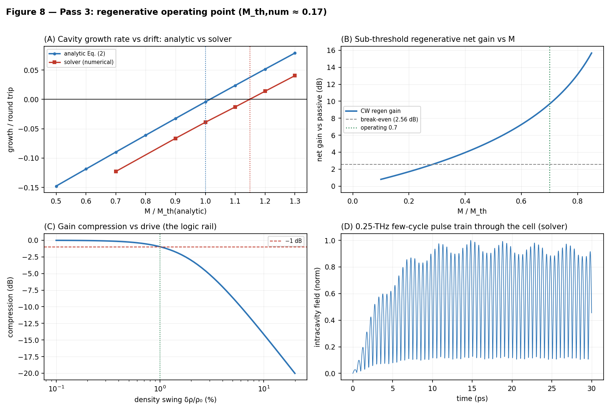

<div align="center">

<picture>
  <source media="(prefers-color-scheme: dark)" srcset="branding/boogie-sorbet-dark.svg">
  
</picture>

**An open feasibility program for room-temperature terahertz computing on a graphene-plasmon fabric — developed in the open, with every number reproducible.**

[](https://doi.org/10.5281/zenodo.20674840)
[](https://doi.org/10.5281/zenodo.21185177)


</div>

> **Where this project honestly stands.** The Fable Computer is a *design study*, not a demonstrated device. Its claims are "in-model": established within a transparent, reduced-order model chain that you can run yourself from this repository — not measured on hardware. The central physical assumption (regenerative gain in a Dyakonov–Shur graphene-plasmon cell at room temperature) has **never been demonstrated experimentally**. The manuscripts have not received independent expert review, and they say so on page one. This community exists to close that gap: check the models, build the missing simulation tiers, and get the design to a real bench experiment — or find the error that kills it. **A clean negative result is a success here.**

---

## What is the Fable Computer?

Today's chips move electrons through transistors a few billion times per second. A **graphene plasmon** — a ripple in the electron fluid of an atomically thin carbon sheet — oscillates hundreds of times faster (~1 THz) and squeezes that wave into a footprint about a hundred times smaller than its free-space wavelength, with no cryostat required. It is an attractive carrier for logic, with one brutal problem: the ripple dies out in about a picosecond. Launched passively, a bit fades below any usable read threshold within a handful of gates.

The Fable Computer is an architecture built around one answer to that problem: **make every gate an amplifier**. Each logic gate is the same physical object — a tiny resonant plasmon cavity carrying a DC drift current, biased just *below* its self-oscillation threshold so it behaves as a regenerative amplifier. Every gate restores signal levels as it computes, the way early vacuum-tube machines regenerated their pulses. The system clock is a phase-stable optical pulse train launched at the fabric edge; memory lives in gate charge between operations.

**Part I** designs the smallest complete machine on this fabric — a **half adder**: five regenerative cells computing Sum and Carry, one addition per 4-picosecond slot (2.5×10¹¹ additions/s, wave-pipelined), at roughly 0.4 femtojoules per addition on the fabric side, in a footprint of about 12 × 16 µm. A five-pass feasibility chain converges on one self-consistent operating point and checks it end to end: gain budget, logic transfer, noise, disorder-limited yield, thermal ceiling, and the validity of the underlying hydrodynamics.

**Part II** asks what the same fabric computes when its pulses are treated as what they are: quantum fields. A logic pulse turns out to be a *mesoscopic* object — the 1-dB compression knee sits at ≈38 plasmons, the logic rail at ≈3,800 — so quantum noise is a design input, not a curiosity. Two results follow. An honest no-go: this cell cannot host plasmonic qubits (the single-plasmon nonlinearity misses by five orders of magnitude). And a constructive result: below the knee the fabric is a **quantum-limited analog tensor engine** — coherent pulses interfere at gate-programmed junctions and the result is digitized on-chip by the same threshold cells, re-programmed as a 1–2-bit flash decoder. Part II computes its error rates versus temperature and locates the quantum–classical crossover at T_Q ≈ 48 K.



*Figure 8 of Part I, regenerated by the code in this repository: the regenerative operating point — analytic vs numerical threshold, sub-threshold gain, gain compression (the logic rail), and a 0.25-THz pulse train through the cell.*

## The papers

| | Title | What it establishes |
|---|---|---|
| **Part I** | [The Fable Computer: A Room-Temperature Terahertz Half Adder on a Regenerative Graphene-Plasmon Logic Fabric](papers/Fable-Computer-Part-I.pdf) · [DOI](https://doi.org/10.5281/zenodo.20674840) | Concept, architecture, and a five-pass reduced-order feasibility chain for the clocked, regenerative logic fabric and its half-adder demonstrator. Ends with a pre-registered five-gate bench protocol. |
| **Part II** | [Quantum-Limited Analog Tensor Processing on the Regenerative Graphene-Plasmon Fabric](papers/Fable-Computer-Part-II.pdf) · [DOI](https://doi.org/10.5281/zenodo.21185177) | Quantizes the Part-I cell: the plasmonic-qubit no-go, the QMAC-1 analog tensor unit with on-chip classical decoding, and the temperature budget of the quantum–classical crossover. |

Both manuscripts carry a full authorship and status disclaimer: they were prepared by an independent researcher with AI assistance (including an orchestrated literature-verification audit), they are not peer-reviewed, and their claims are offered as a starting point for discussion — which is exactly where this community comes in.

*Note: the manuscripts are living documents. The community's vetted findings (see [notes/](notes/)) are folded back into them in periodic community revisions — the current PDFs in `papers/` (Part I v5.2, Part II v1.2) cite this repository (one legacy availability link in Part II's Table QA1 still points to the author's earlier repository and will be corrected in the next revision) and may run ahead of the archived Zenodo versions; the DOIs above always resolve to the last archived release, and the git history of `papers/` records every revision.*

**New here?** Two short companion documents summarize everything: [The Fable Computer — An Introduction](docs/Fable-Computer-Introduction.pdf) (six pages: the idea, the numbers, and what remains open) and the [Community Guidelines](docs/Fable-Computer-Community-Guidelines.pdf) (how to join in). Editable sources sit alongside them in [docs/](docs/).

## Run the models yourself

The pure-Python model chains in this repository reproduce every quantitative model claim in the papers — Part I's Sections 7–8 and Figures 6–10, and every number in Part II. Dependencies: Python 3.11+, `numpy`, and (for figures) `matplotlib`. Depending on your system, the interpreter is `python` or `python3`.

```bash
git clone https://github.com/ryoji-info/FableComputer.git
cd FableComputer

# Part I — the five-pass feasibility chain
cd fable-model-chain
python run_all.py --json     # prints every manuscript number; writes results.json
python figures.py            # regenerates Figures 6-10

# Part II — the quantum extension
cd ../fable-model-quantum
python run_all.py --json     # prints every Part-II number; writes results.json
python figures.py            # regenerates Figures Q1-Q5
```

Each module is also runnable on its own and prints a self-check against the manuscript values (e.g. `python ds_cell.py`, `python qmode.py`). See the READMEs in [fable-model-chain](fable-model-chain/README.md) and [fable-model-quantum](fable-model-quantum/README.md) for what each pass computes and — just as important — the documented caveats and free parameters.

## What is proven, what is modeled, what is open

- **Demonstrated in the literature:** every subsystem rests on a published precedent (on-chip THz plasmon transport, microcomb-photomixing clock chains, monolithic THz striplines). Room-temperature, current-driven amplification of THz radiation by graphene plasmons has been demonstrated **once** — and its authors attribute the effect to a different mechanism than the one this design assumes. Part I, Section 2 states this plainly.
- **In-model (this repository):** the operating point, gain budget, logic transfer, noise figure, disorder yield, thermal ceiling, and Part II's error-rate-versus-temperature curves.
- **Open — the work this community is for:**
  1. A **Boltzmann–Maxwell tier**: a full kinetic + electromagnetic solve owning coupling and absolute calibration (Part I, Section 10).
  2. **Pulsed clock synthesis**: extending the demonstrated continuous-wave microcomb chain to the pulse train the fabric needs.
  3. **The bench experiment**: a pre-registered five-gate pass/fail protocol. The single most informative outcome in the whole program, pass *or* fail, is the first cascade of two room-temperature plasmonic gain cells.

## The community

This project is developed in the open, and its direction — including how any community funds are spent — is decided by the people doing the work. The governance model borrows from the communities that have kept open, volunteer-run projects durable for decades — Apache's lazy consensus, Debian's earned membership, Blender's transparently funded development, Open Collective's public-ledger norms — and **it deliberately uses no blockchain and no tokens**. Everything runs on simple, auditable data: version-controlled files, public discussions, and recorded votes.

**Principles:**

1. **Radical transparency.** Models, data, decisions, and money are public. The treasury ledger and every funding decision live in this repository's history.
2. **Honest uncertainty.** Every claim is labeled: demonstrated, in-model, or open. Negative results and failed replications are first-class contributions.
3. **Defensive publication.** Everything is published openly and permanently so that no one — including us — can enclose it behind patents.
4. **Membership is earned, not bought.** There is nothing to purchase. Contributors who show up and do the work gain a recorded voice in decisions.
5. **Simple tools.** Governance records are plain files in git: a members registry, a decision log, a treasury ledger. No crypto, no smart contracts — the git history is the audit trail.

**How decisions work (short version):** day-to-day technical decisions happen by open discussion and lazy consensus in issues and pull requests. Spending proposals and structural decisions get a structured review — a public proposal, a scored community rubric, and a recorded vote — archived permanently as numbered decision records in the repository. The full rules, including the written thresholds at which the founder's role hands over to elected community governance, live in [GOVERNANCE.md](GOVERNANCE.md).

**The Agent Lab — a community loop, run in the open.** The project also operates three fully disclosed AI research agents — Fabric 🧵 (architecture), Kinetic 🌊 (transport & numerics), and Quanta ⚛️ (quantum limits) — whose complete system prompts, schedules, and code are public in [agents/README.md](agents/README.md). They power a repeating four-step cycle: **(1)** the agents read the community and post daily analyses in [Discussions](https://github.com/ryoji-info/FableComputer/discussions) — or on demand, when the maintainer triggers a run; **(2)** they each draft a candidate question for Claude Fable 5, Anthropic's most capable model, and pick one by recorded 2-of-3 vote; **(3)** they review Fable 5's replies — and their own weekly draft notes — and vote 2-of-3 on what enters the permanent record in [notes/](notes/); **(4)** the maintainer uses Fable 5 to fold the promoted findings back into the manuscripts as versioned community revisions. Agents are tools, not members: every merge is made by a human, and a human correction outranks any agent conclusion.

## How to get involved

Wherever you're coming from, there is a first contribution here:

- **Physicists (plasmonics, hydrodynamic electrons, quantum optics):** red-team the models. Each paper states exactly which assumptions are load-bearing (Part I, Section 2; Part II, Sections 2–3 and 8). Finding a fatal flaw is a headline contribution, not an attack — and substantive contributions earn co-authorship on resulting papers under a written policy ([AUTHORSHIP.md](AUTHORSHIP.md)).
- **Numerics / simulation people:** the Boltzmann–Maxwell tier is the project's biggest open build — a real kinetic + EM solve to replace the reduced-order chain's calibration assumptions.
- **Engineers (THz, photonics, fab):** the bench protocol needs costing, equipment lists, and lab partnerships; the clock chain needs a pulsed-synthesis design.
- **Everyone else:** run the model chain and report your results in [REPLICATIONS.md](REPLICATIONS.md) (a reproduction report is a real contribution, especially when the numbers *don't* match); improve documentation; translate; or help build the community's tooling.

**Start here:**

1. Read [CONTRIBUTING.md](CONTRIBUTING.md) and the [Code of Conduct](CODE_OF_CONDUCT.md).
2. Introduce yourself in [GitHub Discussions](https://github.com/ryoji-info/FableComputer/discussions).
3. Pick something from the [open issues](https://github.com/ryoji-info/FableComputer/issues) — or open one.

## Roadmap

The near-term arc: publish and harden the models → grow a reviewing community → establish transparent funding → cost and pre-register the bench experiment → run it. The live version, with what's done and what's next, is in [ROADMAP.md](ROADMAP.md).

## License and citation

- **Code** (`fable-model-chain/`, `fable-model-quantum/`): Apache License 2.0 — permissive, with an explicit patent grant that protects contributors and users.
- **Manuscripts, documentation, and figures:** CC BY 4.0.

The full scheme — including the license declared in advance for future hardware design files and the commitment never to tighten any of it — is in [LICENSING.md](LICENSING.md).

If you build on this work, please cite the manuscripts (see [CITATION.cff](CITATION.cff)) and say what you changed.

## Contact

- GitHub Discussions (preferred for anything project-related)
- Ryoji Furui — [info@ryoji.info](mailto:info@ryoji.info) · [www.ryoji.info](https://www.ryoji.info)
